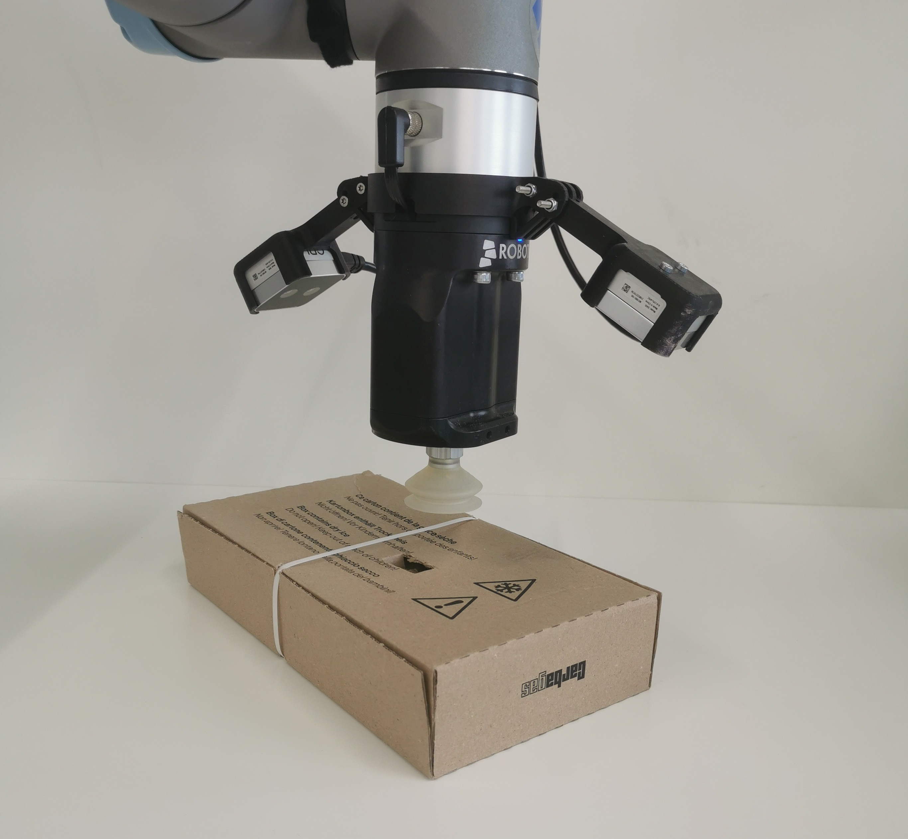
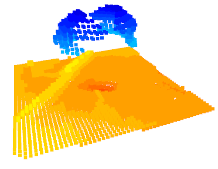

# Voxel SERL - real-world reinforcement learning in the context of vacuum gripping

**Webpage: [nisutte.github.io](https://nisutte.github.io/)** \
**Paper: [arxiv.org/abs/2503.02405](https://arxiv.org/abs/2503.02405)**

<p style="display: flex; align-items: center;">
  
  
</p>
  
Voxel SERL builds upon the original [SERL](https://github.com/rail-berkeley/serl] implementation)  implementation by incorporating additional modalities into the reinforcement learning pipeline. It utilizes 3D spatial perception to improve the robustness of real-world vacuum gripping.$

## Handover TODO's

- [x] Make dual robot pointcloud work
- [x] set up BT to grip a box at the start
- [x] set up start poses
- [x] come up with a good reward
- [x] collision detection between robots
- [x] add difference parameters between the EE
- [x] share the same voxnet backbone (less gpu mem, also can be frozen)
- [x] add seconds passed since last action to the state
- [x] improve camera frame polling (sometimes very slow) 
  - camera lag time is ~60ms, quite high but i cannot do much about it
- [x] actions in the obs are transformed to base frame, we do not want that (so action input is different from action obs)
- [x] do some demos and first training runs
- [x] ADD MAX FORCE
- [x] add huge negative penalty for dropping box
- [x] fix observation statistics wrapper
- [x] I have to fix the "End of file" bug in the controller, otherwise i make no progress
- [x] Do propper normalization (over rlds dataset)
- [x] remodel to immediate reward (on the chosen actions)
- [x] make it impossible to drop the box, not just huge reward (policy is dumb)
- [x] make RLDS save the pointclouds as well, such that i can post-train the VoxNet with the data captured
- [x] make a data consistency checker for the replay buffer!
- [x] clean up relative env mess (once again, sigh...)
- [ ] make training more stable and add more useful obs
  - [x] added state augmentation (noise)
  - [x] changed activation to relu
  - [x] made tanh distribution narrower (less noisy actions, less jitter)
  - [ ] really ensemblize critic!
  - [ ] update the voxnet with the new relu and LN 
  - [ ] test dropout?
- [ ] train only on pc data, like in the picking task
- [ ] Make a simple uv setup for future usage (from requirements, and also add external JAX links, tough...)
- [ ] Add pose estimation to automate the pickup
- [ ] examine ensemble sizes and subsampling
- [ ] make position augmentation for pose data (also rotation)
- [ ] enhance voxel grid augmentation (tough since it is 3dconv)


## Contributions

| Code Directory                                                                                             | Description                                |
|------------------------------------------------------------------------------------------------------------|--------------------------------------------|
| [robot_controllers](https://github.com/nisutte/voxel-serl/tree/develop/serl_robot_infra/robot_controllers) | Impedance controller for the UR5 robot arm |
| [box_picking_env](https://github.com/nisutte/voxel-serl/tree/develop/serl_robot_infra/box_picking_env)     | Environment setup for the box picking task |
| [vision](https://github.com/nisutte/voxel-serl/tree/develop/serl_launcher/serl_launcher/vision)            | Point-Cloud based encoders                 |
| [utils](https://github.com/nisutte/voxel-serl/blob/develop/serl_robot_infra/ur_env/camera/utils.py)        | Point-Cloud fusion and voxelization        |

## Quick start guide for box picking with a UR5 robot arm

### Without cameras

1. Follow the installation in the official [SERL repo](https://github.com/rail-berkeley/serl).
2. Check [envs](https://github.com/nisutte/voxel-serl/blob/develop/serl_robot_infra/ur_env/envs) and either use the provided [box_picking_env](https://github.com/nisutte/voxel-serl/blob/develop/serl_robot_infra/ur_env/envs/camera_env/box_picking_camera_env.py) or set up a new environment using the one mentioned as a template. (New environments have to be registered [here](https://github.com/nisutte/voxel-serl/blob/develop/serl_robot_infra/ur_env/__init__.py))
2. Use the [config](https://github.com/nisutte/voxel-serl/blob/develop/serl_robot_infra/ur_env/envs/camera_env/config.py) file to configure all the robot-arm specific parameters, as well as gripper and camera infos.
3. Go to the [box picking](https://github.com/nisutte/voxel-serl/blob/develop/examples/box_picking_drq) folder and modify the bash files ```run_learner.py``` and ```run_actor.py```. If no images are used, set ```camera_mode``` to ```none``` . WandB logging can be deactivated if ```debug``` is set to True.
4. Record 20 demostrations using [record_demo.py](https://github.com/nisutte/voxel-serl/blob/develop/examples/box_picking_drq/record_demo.py) in the same folder. Double check that the ```camera_mode``` and all environment-wrappers are identical to [drq_policy.py](https://github.com/nisutte/voxel-serl/blob/develop/examples/box_picking_drq/drq_policy.py).
5. Execute ```run_learner.py``` and ```run_actor.py``` simultaneously to start the RL training.
6. To evaluate on a policy, modify and execute ```run_evaluation.py``` with the specified checkpoint path and step. 

## Modaliy examples
<p>
  
</p>

